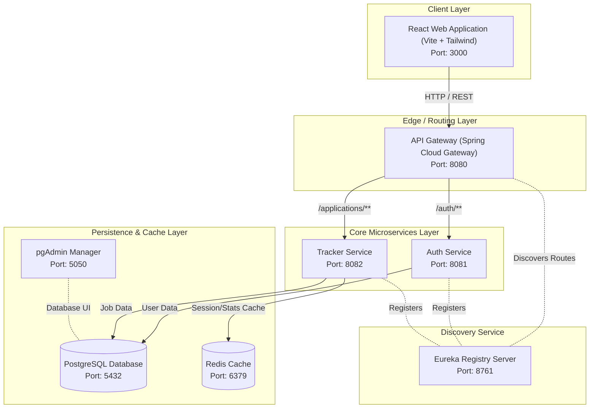
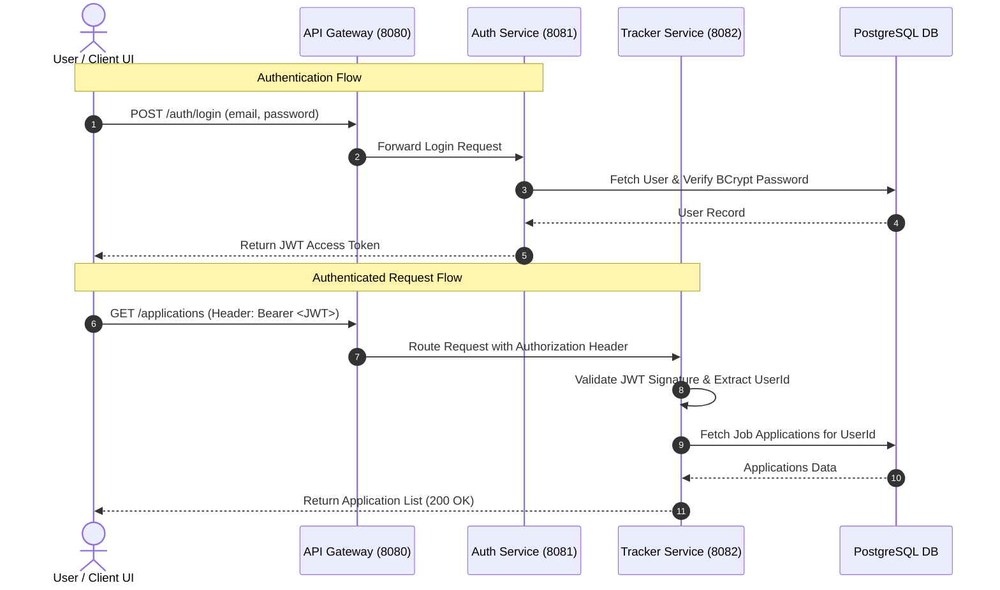
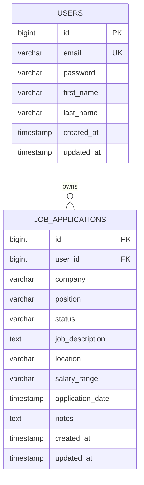

# 🚀 Applypilot - Enterprise Microservices Job Tracking Platform

[](https://spring.io/projects/spring-boot)
[](https://spring.io/projects/spring-cloud)
[](https://www.oracle.com/java/)
[](https://reactjs.org/)
[](https://vitejs.dev/)
[](https://www.docker.com/)

**Applypilot** is an enterprise-grade, microservices-architected application designed to streamline job search workflows, application tracking, status management, and real-time candidate analytics. Built using modern Java 21, Spring Boot 3.4.1, Spring Cloud Netflix Eureka, Spring Cloud Gateway, PostgreSQL 16, Redis 7, and a modern React Vite frontend.

---

## 📑 Table of Contents

- [Core Features](#-core-features)
- [System Architecture & Topology](#-system-architecture--topology)
- [Microservices Architecture Breakdown](#-microservices-architecture-breakdown)
- [Security & Authentication Flow](#-security--authentication-flow)
- [Database Schema & Data Models](#-database-schema--data-models)
- [REST API Specifications](#-rest-api-specifications)
- [Technology Stack](#-technology-stack)
- [Directory Structure](#-directory-structure)
- [Getting Started & Local Setup](#-getting-started--local-setup)
  - [Prerequisites](#prerequisites)
  - [Option A: Containerized Setup (Docker Compose)](#option-a-containerized-setup-docker-compose)
  - [Option B: Bare-Metal / Local Development Setup](#option-b-bare-metal--local-development-setup)
- [Testing & Verification](#-testing--verification)

---

## ✨ Core Features

- 🔒 **Centralized Authentication & Authorization**: Secure user registration, BCrypt password hashing, and stateless JWT token issue/validation.
- 🌐 **Dynamic Service Discovery**: Service registration and discovery powered by **Spring Cloud Netflix Eureka Server**.
- 🌉 **Unified API Gateway**: Request routing, rate-limiting readiness, and global CORS handling through **Spring Cloud Gateway**.
- 📊 **Job Application Tracker**: Full CRUD operations for job applications (Company, Job Title, Description, Location, Salary, Application Date, Notes).
- 🔄 **Application Workflow Lifecycle**: State transitions (`APPLIED`, `INTERVIEWING`, `OFFER`, `REJECTED`).
- ⚡ **Redis High-Performance Caching**: Intelligent caching of user application stats and active listings with automated cache invalidation upon state updates.
- 🎨 **Modern Glassmorphism Frontend UI**: Built with React 18, Vite, Tailwind CSS, Lucide icons, and Axios with dynamic JWT interceptors.

---

## 🏗️ System Architecture & Topology

The platform operates as a distributed system composed of containerized microservices communicating via service discovery and unified through an API Gateway:



---

## 🧱 Microservices Architecture Breakdown

| Service / Container | Tech Stack | Port | Primary Responsibilities |
| :--- | :--- | :--- | :--- |
| **`eureka-server`** | Spring Cloud Netflix Eureka | `8761` | Service Registry providing dynamic instance registration and heartbeats. |
| **`api-gateway`** | Spring Cloud Gateway | `8080` | Entry point for external traffic; handles global CORS, routing to microservices (`auth-service`, `tracker-service`). |
| **`auth-service`** | Spring Boot, Spring Security, JPA | `8081` | Manages user credentials, registration, password hashing (BCrypt), and JWT token generation. |
| **`tracker-service`** | Spring Boot, Spring Data JPA, Redis | `8082` | Handles job application lifecycle, status updates, metadata, and analytics caching. |
| **`frontend`** | React 18, Vite, Tailwind CSS | `3000` / `5173` | Interactive Single Page Application (SPA) with Kanban boards, statistics charts, and forms. |
| **`postgres`** | PostgreSQL 16 Alpine | `5432` | Relational database holding user tables and job applications. |
| **`redis`** | Redis 7 Alpine | `6379` | In-memory key-value cache for caching high-frequency application query results. |
| **`pgadmin`** | pgAdmin 4 | `5050` | Web interface for database administration and SQL inspection. |

---

## 🔐 Security & Authentication Flow

Applypilot implements stateless **JSON Web Token (JWT)** security:



---

## 💾 Database Schema & Data Models

The relational data model consists of `users` and `job_applications` with foreign key relations:



---

## 📡 REST API Specifications

### 🔑 Authentication Service (`/auth/**` via Gateway `http://localhost:8080/auth`)

| Method | Endpoint | Access | Description | Request Payload / Params | Response |
| :--- | :--- | :--- | :--- | :--- | :--- |
| `POST` | `/auth/register` | Public | Register a new user | `{ "email": "user@example.com", "password": "secretPassword", "firstName": "Jane", "lastName": "Doe" }` | `201 Created` - `{ "token": "...", "user": {...} }` |
| `POST` | `/auth/login` | Public | Authenticate user credentials | `{ "email": "user@example.com", "password": "secretPassword" }` | `200 OK` - `{ "token": "...", "user": {...} }` |
| `GET` | `/auth/me` | Bearer JWT | Fetch current authenticated user profile | Header: `Authorization: Bearer <token>` | `200 OK` - `{ "id": 1, "email": "...", "firstName": "Jane", "lastName": "Doe" }` |

### 💼 Application Tracker Service (`/applications/**` via Gateway `http://localhost:8080/applications`)

| Method | Endpoint | Access | Description | Request Payload / Params | Response |
| :--- | :--- | :--- | :--- | :--- | :--- |
| `GET` | `/applications` | Bearer JWT | Retrieve all job applications for user | Header: `Authorization: Bearer <token>` | `200 OK` - List of `JobApplicationDto` |
| `GET` | `/applications/{id}` | Bearer JWT | Fetch specific application details | Header: `Authorization: Bearer <token>` | `200 OK` - `JobApplicationDto` |
| `POST` | `/applications` | Bearer JWT | Create a new job application | `{ "company": "Acme", "position": "Engineer", "status": "APPLIED", ... }` | `201 Created` - `JobApplicationDto` |
| `PUT` | `/applications/{id}` | Bearer JWT | Update entire job application details | `{ "company": "Acme", "position": "Senior Engineer", ... }` | `200 OK` - `JobApplicationDto` |
| `PATCH` | `/applications/{id}/status` | Bearer JWT | Update application stage status | `{ "status": "INTERVIEWING" }` | `200 OK` - `JobApplicationDto` |
| `DELETE` | `/applications/{id}` | Bearer JWT | Remove job application | Header: `Authorization: Bearer <token>` | `204 No Content` |
| `GET` | `/applications/stats` | Bearer JWT | Fetch summary stats (Applied, Interviewing, Offers, Rejected) | Header: `Authorization: Bearer <token>` | `200 OK` - `JobApplicationStatsDto` |

---

## 🛠️ Technology Stack

- **Language & Runtime**: Java 21 (LTS)
- **Framework**: Spring Boot 3.4.1
- **Service Discovery**: Spring Cloud Netflix Eureka
- **API Gateway**: Spring Cloud Gateway MVC
- **Security**: Spring Security 6, JJWT (io.jsonwebtoken 0.11.5)
- **Persistence**: Spring Data JPA, Hibernate, PostgreSQL 16
- **Caching**: Spring Data Redis, Lettuce Client, Redis 7
- **Build Tools**: Apache Maven 3.9+
- **Containerization**: Docker, Docker Compose
- **Frontend SPA**: React 18, Vite 5, Tailwind CSS 3, Axios, Lucide React Icons

---

## 📁 Directory Structure

```
Applypilot/
├── pom.xml                        # Root Maven Parent POM
├── docker-compose.yml              # Complete Multi-Container Compose Config
├── README.md                       # Architecture & Documentation
├── eureka-server/                  # Spring Cloud Eureka Service Registry
│   ├── Dockerfile
│   ├── pom.xml
│   └── src/main/
│       ├── java/com/applypilot/eurekaserver/EurekaServerApplication.java
│       └── resources/application.yml
├── api-gateway/                    # Spring Cloud API Gateway Service
│   ├── Dockerfile
│   ├── pom.xml
│   └── src/main/
│       ├── java/com/applypilot/apigateway/
│       │   ├── ApiGatewayApplication.java
│       │   └── config/GatewayConfig.java
│       └── resources/application.yml
├── auth-service/                   # Authentication & User Management Service
│   ├── Dockerfile
│   ├── pom.xml
│   └── src/main/
│       ├── java/com/applypilot/auth/
│       │   ├── controller/AuthController.java
│       │   ├── entity/User.java
│       │   ├── repository/UserRepository.java
│       │   ├── security/
│       │   └── service/AuthService.java
│       └── resources/application.yml
├── tracker-service/                # Application Lifecycle & Tracking Service
│   ├── Dockerfile
│   ├── pom.xml
│   └── src/main/
│       ├── java/com/applypilot/tracker/
│       │   ├── controller/JobApplicationController.java
│       │   ├── entity/JobApplication.java
│       │   ├── repository/JobApplicationRepository.java
│       │   ├── security/
│       │   └── service/JobApplicationService.java
│       └── resources/application.yml
└── frontend/                       # Vite React SPA Web Client
    ├── Dockerfile
    ├── package.json
    ├── vite.config.js
    ├── index.html
    └── src/
        ├── components/
        ├── context/
        ├── services/
        └── App.jsx
```

---

## 🚀 Getting Started & Local Setup

### Prerequisites

Ensure you have the following installed on your host system:
- **Java JDK 21+**
- **Maven 3.9+**
- **Node.js 20+ & npm**
- **Docker & Docker Compose**

---

### Option A: Containerized Setup (Docker Compose)

The easiest way to launch the entire end-to-end stack is using Docker Compose:

1. **Clone the repository**:
   ```bash
   git clone https://github.com/Rajathacharya24/Applypilot.git
   cd Applypilot
   ```

2. **Build and launch all services**:
   ```bash
   docker-compose up --build -d
   ```

3. **Verify running containers**:
   ```bash
   docker-compose ps
   ```

4. **Access the application**:
   - **Frontend UI**: [http://localhost:3000](http://localhost:3000)
   - **API Gateway**: [http://localhost:8080](http://localhost:8080)
   - **Eureka Dashboard**: [http://localhost:8761](http://localhost:8761)
   - **pgAdmin**: [http://localhost:5050](http://localhost:5050) (User: `admin@applypilot.com`, Pass: `admin`)

5. **Teardown**:
   ```bash
   docker-compose down -v
   ```

---

### Option B: Bare-Metal / Local Development Setup

If running microservices individually for development:

#### Step 1: Start PostgreSQL and Redis containers
```bash
docker-compose up -d postgres redis
```

#### Step 2: Build all Maven backend modules
```bash
mvn clean install
```

#### Step 3: Run services in sequence (separate terminal tabs)

1. **Eureka Server**:
   ```bash
   cd eureka-server
   mvn spring-boot:run
   ```
   *Runs on port 8761*

2. **API Gateway**:
   ```bash
   cd api-gateway
   mvn spring-boot:run
   ```
   *Runs on port 8080*

3. **Auth Service**:
   ```bash
   cd auth-service
   mvn spring-boot:run
   ```
   *Runs on port 8081*

4. **Tracker Service**:
   ```bash
   cd tracker-service
   mvn spring-boot:run
   ```
   *Runs on port 8082*

#### Step 4: Run Frontend Development Server
```bash
cd frontend
npm install
npm run dev
```
*Access frontend at [http://localhost:5173](http://localhost:5173)*

---

## 🧪 Testing & Verification

### Running Automated Unit Tests
To execute all backend unit tests across all microservices:
```bash
mvn test
```

### Verifying Frontend Build
To test the frontend production bundle build:
```bash
cd frontend
npm run build
```

---

## 📜 License

This project is licensed under the **MIT License**.